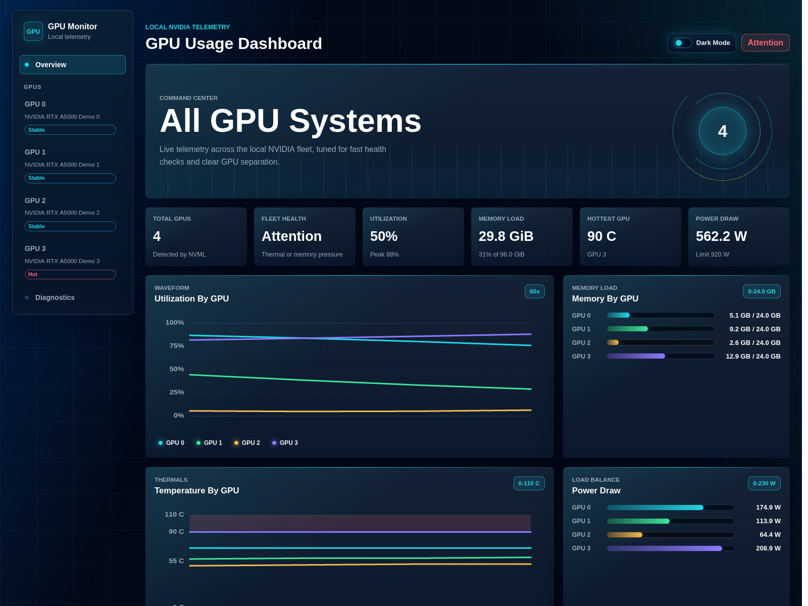
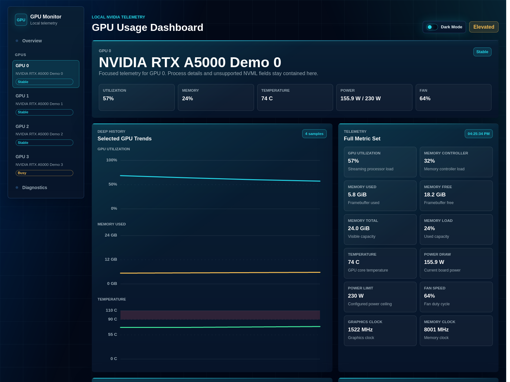
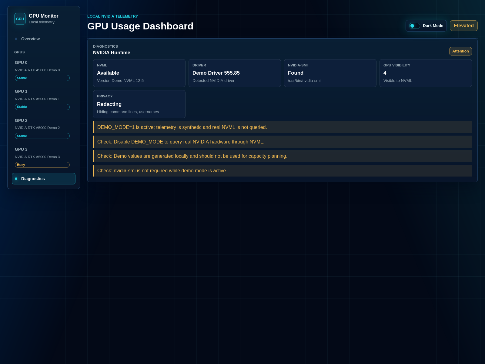

# GPU Usage Dashboard

[](https://github.com/jhairgallardo/gpu_usage_dashboard/actions/workflows/ci.yml)

A local, browser-based NVIDIA GPU monitoring dashboard for Linux workstations.
It shows real-time usage, memory, temperature, power, fan, clock, process, and
diagnostic information for every NVIDIA GPU visible to the machine.

The app is intentionally simple to run: one shell script starts a FastAPI server
on `127.0.0.1`, serves a vanilla HTML/CSS/JavaScript dashboard, and collects GPU
telemetry through NVIDIA NVML via `nvidia-ml-py`. There is no Node.js build step.

## AI Disclosure

This project was developed through a human-directed AI workflow with OpenAI
Codex. The implementation, documentation, tests, screenshots, and release
preparation were built incrementally with AI assistance, then reviewed and
validated through local checks before publication.

## Screenshots

These screenshots are captured from synthetic demo telemetry with usernames and
command lines redacted.



| Per-GPU Detail | Diagnostics |
| --- | --- |
|  |  |

To refresh the screenshots, start the app in public-safe demo mode and capture
the browser viewport without browser chrome:

```bash
SHOW_COMMAND_LINES=0 SHOW_USERNAMES=0 DEMO_MODE=1 PORT=8090 ./run_dashboard.sh
```

Capture these routes:

- `http://127.0.0.1:8090/#overview`
- `http://127.0.0.1:8090/#gpu-0`
- `http://127.0.0.1:8090/#diagnostics`

## Features

- All-GPU overview with utilization, memory, temperature, power, health, and
  rolling history charts.
- Per-GPU detail views with full metrics, unavailable-field explanations, and
  process details when permissions allow them.
- Diagnostics view for NVML, NVIDIA driver, `nvidia-smi`, and GPU visibility.
- Dark and light themes with local browser persistence.
- One-command local startup through `./run_dashboard.sh`.
- Structured GPU data through NVML rather than fragile command-output parsing.
- Clear degraded states for missing drivers, missing NVML, no visible GPUs, and
  unsupported metrics.

## Requirements

For real GPU telemetry:

- Linux
- Python 3.8+ with `venv` support
- NVIDIA driver installed and loaded
- NVIDIA NVML library available through the driver
- One or more NVIDIA GPUs visible to the current user

For previewing the dashboard without NVIDIA hardware, use demo mode.

`nvidia-smi` is recommended for diagnostics and manual comparison. The dashboard
uses NVML through Python as its primary data source.

On Debian or Ubuntu systems, you may need:

```bash
sudo apt install python3 python3-venv
```

## Quick Start

Clone the repository and start the local dashboard:

```bash
git clone https://github.com/jhairgallardo/gpu_usage_dashboard.git
cd gpu_usage_dashboard
chmod +x run_dashboard.sh
./run_dashboard.sh
```

The script creates or reuses `.venv`, installs `requirements.txt`, and starts
the server bound to `127.0.0.1:8080`.

Open:

```text
http://127.0.0.1:8080
```

Use a different port:

```bash
PORT=8090 ./run_dashboard.sh
```

Use a specific Python interpreter:

```bash
PYTHON_BIN=/usr/bin/python3 ./run_dashboard.sh
```

## Runtime Configuration

The dashboard is configured with environment variables passed to
`./run_dashboard.sh`:

| Variable | Default | Purpose |
| --- | --- | --- |
| `PORT` | `8080` | Local HTTP port. |
| `HOST` | `127.0.0.1` | Bind address. Keep the default for local-only access. |
| `PYTHON_BIN` | `python3` | Python interpreter used to create `.venv`. |
| `DEMO_MODE` | unset | Set to `1`, `true`, `yes`, `on`, or `demo` for synthetic telemetry. |
| `SHOW_PROCESS_DETAILS` | `1` | Set to `0` to hide all per-process rows. |
| `SHOW_COMMAND_LINES` | `1` | Set to `0` to redact process command lines. |
| `SHOW_USERNAMES` | `1` | Set to `0` to redact Linux usernames. |

Examples:

```bash
PORT=8090 ./run_dashboard.sh
SHOW_COMMAND_LINES=0 ./run_dashboard.sh
SHOW_USERNAMES=0 SHOW_COMMAND_LINES=0 ./run_dashboard.sh
SHOW_PROCESS_DETAILS=0 ./run_dashboard.sh
```

The script supports `HOST`, but the default `127.0.0.1` bind is the recommended
setting. If you bind to a non-local address, the startup script prints a warning
because GPU process metadata can expose local system information.

## Demo Mode

Demo mode lets you preview the dashboard without NVIDIA hardware or NVML access:

```bash
DEMO_MODE=1 ./run_dashboard.sh
```

Use it with a custom port if you already have the real dashboard running:

```bash
DEMO_MODE=1 PORT=8090 ./run_dashboard.sh
```

Demo mode serves realistic synthetic telemetry through the same `/api/snapshot`
and `/api/diagnostics` contracts used by the real collector. Values change over
time so polling, charts, overview tiles, per-GPU detail views, diagnostics, and
process sections are visible.

The diagnostics view and diagnostics API clearly label demo mode. Synthetic
values are for previewing the interface only; unset `DEMO_MODE` to query real
NVIDIA GPUs through NVML.

## Dashboard Workflow

Open `#overview` first for a fleet-level command center. It shows high-level GPU
status without process tables:

```text
http://127.0.0.1:8080/#overview
```

Select a GPU from the side navigation, or click a GPU tile, to open a detailed
route:

```text
http://127.0.0.1:8080/#gpu-0
```

Each `#gpu-N` page focuses on one GPU and includes:

- GPU and memory-controller utilization
- memory used, free, total, and load
- temperature
- power draw and limit
- fan speed
- graphics and memory clocks
- unsupported metrics with reasons
- GPU processes with PID, process name, username, GPU memory, status, and command
  line when available

Open diagnostics when telemetry is incomplete or unavailable:

```text
http://127.0.0.1:8080/#diagnostics
```

## Local API

Health check:

```bash
curl http://127.0.0.1:8080/health
```

Current GPU snapshot:

```bash
curl http://127.0.0.1:8080/api/snapshot
```

NVIDIA runtime diagnostics:

```bash
curl http://127.0.0.1:8080/api/diagnostics
```

## Privacy And Security

This project is designed for trusted local use on your own Linux machine. It
binds to `127.0.0.1` by default so other machines cannot reach it.

Per-GPU detail views may display sensitive local system information, including:

- process IDs
- process names
- Linux usernames
- command lines
- per-process GPU memory usage

Linux permissions may hide some process fields. When a field is unavailable,
the dashboard reports it as unavailable instead of failing.

You can also redact sensitive process metadata at runtime:

```bash
SHOW_PROCESS_DETAILS=0 ./run_dashboard.sh
SHOW_COMMAND_LINES=0 ./run_dashboard.sh
SHOW_USERNAMES=0 ./run_dashboard.sh
```

Redacted fields are marked clearly in the API response and in the per-GPU detail
view. Hiding command lines or usernames keeps process rows visible. Hiding
process details keeps the process count but removes the process rows entirely.

Do not expose this dashboard on a public network without adding your own access
control. The current app does not include authentication.

## Troubleshooting

### The dashboard says NVML is unavailable

- Confirm the NVIDIA driver is installed and loaded.
- Run `nvidia-smi`.
- Reboot after installing or updating the driver.
- In containers, confirm NVIDIA devices and libraries are passed through.
- In WSL, confirm your NVIDIA driver and WSL GPU support expose NVML.

### The dashboard starts but reports no GPUs

- Run `nvidia-smi` and confirm the current user can see the GPUs.
- Check that the NVIDIA device files exist, such as `/dev/nvidia0`.
- Confirm the process is running on the host or in a container with GPU access.
- Check MIG mode or other partitioning features if your GPUs use them.

### Some metrics say unavailable

That can be normal. Fan speed, power limit, clocks, per-process memory, usernames,
and command lines vary by GPU model, driver, permissions, laptop configuration,
container runtime, WSL support, and MIG configuration.

Unsupported metrics are shown as unavailable with a reason where NVML provides
one.

### Refresh is stale or retrying

The browser polls `/api/snapshot` once per second while visible and slows down
when the tab is hidden. If the API fails, the dashboard keeps the last successful
snapshot visible and marks telemetry as retrying or stale until the server
recovers.

## Development

Run the same checks used by CI:

```bash
. .venv/bin/activate
python -m pytest
node --check static/app.js
git diff --check
```

Tests mock NVML behavior, so they do not require real NVIDIA hardware.

See `CONTRIBUTING.md` for local setup, demo mode guidance, privacy checks, and
pull request expectations. See `SECURITY.md` for vulnerability and privacy issue
reporting guidance. See `CHANGELOG.md` for release notes.

## Project Structure

```text
gpu_usage_dashboard/
├── .github/            # CI workflow and issue templates
├── app/                 # FastAPI app, diagnostics, and NVML collector
├── docs/screenshots/    # Public-safe demo screenshots used by README
├── static/              # No-build frontend assets
├── tests/               # Mocked backend/API tests
├── CHANGELOG.md
├── CONTRIBUTING.md
├── SECURITY.md
├── requirements.txt
├── run_dashboard.sh
├── README.md
└── LICENSE
```

## License

This project is released under the MIT License. See `LICENSE` for details.
